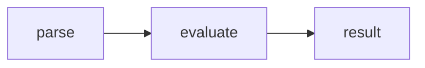

# GitHub-flavored Markdown features

Syntax that works on GitHub, and what happens to it elsewhere. "Elsewhere"
below means npm, PyPI, most docs-site pipelines, and editor previews — the
places a README travels to.

## Alerts

```markdown
> [!NOTE]
> Highlights information that users should take into account, even when skimming.

> [!TIP]
> Optional information to help a user be more successful.

> [!IMPORTANT]
> Crucial information necessary for users to succeed.

> [!WARNING]
> Critical content demanding immediate user attention due to potential risks.

> [!CAUTION]
> Negative potential consequences of an action.
```

- The label line holds only the label. Text starts on the next `>` line.
- Exactly these five, uppercase. Anything else renders as a plain blockquote.
- Multi-line and lists work, as long as every line is prefixed with `>`.
- Elsewhere: a plain blockquote with a visible `[!NOTE]` line. Write the body so
  it survives that.

## Collapsible sections

```markdown
<details>
<summary>Measurement protocol</summary>

Content needs a blank line after `<summary>` or the Markdown inside will not
render.

</details>
```

Works on GitHub and on npm. Use it for long output, benchmark methodology, full
error tables, migration details — anything a minority of readers need.

`<details open>` starts expanded.

## Task lists

```markdown
- [ ] Not done
- [x] Done
```

On GitHub, task lists in issues and PRs are interactive and feed the progress
counter. Elsewhere they render as plain checkbox glyphs.

## Tables

```markdown
| Option | Default | Effect |
| ------ | ------: | ------ |
| `seed` | random | Seeds the per-call RNG |
```

`---:` right-aligns, `:---:` centers. Right-align numeric columns. Tables render
everywhere; there is no reason to avoid them.

## Footnotes

```markdown
Text with a footnote.[^1]

[^1]: The note.
```

GitHub only. Most other renderers print the raw `[^1]`. Skip footnotes in a
README that ships to npm.

## Mermaid diagrams

````markdown

````

GitHub renders these natively. Elsewhere they render as a code block, which is
an acceptable fallback. Keep diagrams small — a diagram wider than the page is
worse than three bullets.

## Code suggestions in review comments

````markdown
```suggestion
const total = sum(values);
```
````

PR review comments only. Produces a one-click "Commit suggestion" button. Use
this instead of describing a small edit in prose.

## Syntax highlighting and diffs

````markdown
```diff
- const x = 1;
+ const x = 2;
```
````

Always tag fences with a language. For "before/after" in a comment, `diff`
beats two untagged blocks.

## Theme-aware images

```markdown
<picture>
  <source media="(prefers-color-scheme: dark)" srcset="./.github/logo-dark.svg">
  
</picture>
```

GitHub honors the media query. Other renderers fall back to the ``, which
is why the light variant belongs there.

For a README published to a registry, images must use **absolute raw URLs**
(`https://raw.githubusercontent.com/<owner>/<repo>/<branch>/...`) — relative
image paths break off-GitHub. Relative links to *files* are fine on GitHub and
break elsewhere; that is usually an acceptable trade for a repo-first README.

## Anchors

Every heading gets an anchor: lowercase, spaces to hyphens, punctuation
dropped. "Upgrading from 2.x" → `#upgrading-from-2x`. Link within a document
with `[Known limitations](#known-limitations)`.

## Permalinks to code

Paste a GitHub file URL with a line range (`#L10-L20`) on its own line in an
issue or PR comment and GitHub expands it into a rendered code snippet. Use the
commit-SHA form (press `y` on the file page) so it does not rot.

## Autolinked references

In issues, PRs, and commit messages: `#123` links the issue, `owner/repo#123`
links across repos, and a bare 40-char SHA links the commit. Closing keywords
(`Closes #1 #23`) wire up the automation — put them on one line.

## What GitHub does not support

- Inline HTML `style` attributes, `<script>`, most CSS — stripped.
- Nested alerts, or an alert inside a list item.
- Arbitrary raw HTML layout. `<p align="center">`, `<picture>`, `<details>`,
  ``, `<sub>`, and `<kbd>` survive; anything fancier is unreliable.
